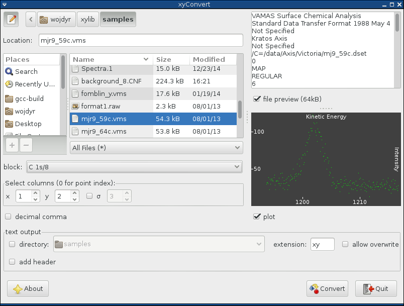

=====
xylib
=====

xylib is a portable library for reading files that contain x-y data from
powder diffraction, spectroscopy and other experimental methods.

It comes with two programs that can convert supported formats
to plain text: command-line **xyconv** and graphical **xyconvert**.

Supported formats:

-  plain text, delimiter-separated values (e.g. CSV)
-  Crystallographic Information File for Powder Diffraction (pdCIF)
-  Siemens/Bruker UXD
-  Siemens/Bruker RAW ver. 1/2/3
-  Philips UDF
-  Philips PC-APD RD raw scan V3/V5
-  Rigaku DAT
-  Sietronics Sieray CPI
-  DBWS/DMPLOT data file
-  Canberra CNF (from Genie-2000 software; aka CAM format)
-  Canberra AccuSpec MCA
-  XFIT/Koalariet XDD
-  RIET7/LHPM/CSRIET/ILL\_D1A5/PSI\_DMC DAT
-  Vamas ISO14976
   *(only experiment modes: SEM or MAPSV or MAPSVDP are supported; 
   only REGULAR scan_mode is supported)*
-  Princeton Instruments WinSpec SPE
   *(only 1-D data is supported)*
- χPLOT CHI_
- Ron Unwin's Spectra XPS format (VGX-900 compatible)

.. _CHI: http://www.esrf.eu/computing/scientific/FIT2D/FIT2D_REF/node115.html#SECTION0001851500000000000000

Examples of supported files are collected in `sample-urls`__.

__ https://raw.github.com/wojdyr/xylib/master/sample-urls

LIBRARY
=======

The library is written in C++ and has C bindings. It can be used directly
through FFI in several other languages, for example `in Python`_.

.. _`in Python`: https://github.com/wojdyr/xylib/blob/master/xylib_capi.py

**API** is documented in the `xylib/xylib.h`__ file.
Adding new formats -- in
`README.dev <https://raw.github.com/wojdyr/xylib/master/README.dev>`_.

__ https://raw.github.com/wojdyr/xylib/master/xylib/xylib.h

Licence: `LGPL <https://raw.githubusercontent.com/wojdyr/xylib/master/COPYING>`_

xylib is used by:

-  `fityk <http://fityk.nieto.pl>`_
-  `qpx-gamma <https://github.com/usnistgov/qpx-gamma>`_
-  ...

xyconv
======

Converts a file from one of the supported formats to plain text::

  xyconv myfile.bin plain.txt

It has a few options, see ``xyconv -h`` for details.

xyConvert
=========

The GUI is designed for quick converting of many files at once.

DOWNLOAD
========

**Binary packages**:

* |ico-win| Windows and |ico-osx| OS X bundles from
  `the latest release on GitHub`__
* |ico-tux| Linux: fresh RPMs and DEBs `from OBS`_

__ https://github.com/wojdyr/xylib/releases/latest
.. _`from OBS`: http://software.opensuse.org/download/package?project=home:wojdyr&package=xyconvert

.. |ico-tux| image:: web/ico-tux.png
.. |ico-osx| image:: web/ico-osx.png

**Source**:

* `tarball`_
* GitHub repository_ |travis-status|_ |appveyor-status|_

.. _`tarball`: https://github.com/wojdyr/xylib/releases/download/v1.4/xylib-1.4.tar.bz2
.. _repository: https://github.com/wojdyr/xylib
.. _travis-status: https://travis-ci.org/wojdyr/xylib/
.. |travis-status| image:: https://api.travis-ci.org/wojdyr/xylib.png
.. _appveyor-status: https://ci.appveyor.com/project/wojdyr/xylib
.. |appveyor-status| image:: https://ci.appveyor.com/api/projects/status/9gotaqqhl8j9ovge?svg=true

To compile the source code you need:

* C++ compiler (all popular ones are tested: GCC, Clang, MSVC, icc)
* Boost_ libraries (only headers).
* optionally, zlib and bzlib libraries (for reading compressed files)
* optionally, wxWidgets 3.0 (for xyconvert - GUI converter)

.. _Boost: http://www.boost.org/

Two build systems are provided: either use CMake or, on Unix,
``./configure && make``. To skip building the GUI use option
``-D GUI=OFF`` for CMake or ``--without-gui`` for configure.
If you are using git, ``autoreconf -i`` is needed before ``./configure``.

AUTHORS
=======

-  Marcin Wojdyr wojdyr@gmail.com (maintainer)
-  Peng ZHANG zhangpengcas@gmail.com

CONTACT
=======

Feel free to send e-mail to the authors, or to the
`fityk-dev mailing list <http://groups.google.com/group/fityk-dev>`_.

CREDITS
=======

-  Google - the library was started as Google Summer of Code 2007 project
   by Peng ZHANG, mentored by Marcin Wojdyr from Fityk organization.
-  Michael Richardson provided VAMAS specification and sample files.
-  David Hovis provided a WinSpec file format specification and sample files.
-  Pablo Bianucci provided his code for reading WinSpec format and sample files.
-  Martijn Fransen provided very useful specifications of Philips formats.
-  Vincent Favre-Nicolin provided PSI\_DMC and ILL\_D1A5 samples;
   reading his ObjCryst library was also helpful.
-  Janos Vegh sent us his VAMAS reading routines (long time ago, before this
   project started).
-  Andreas Breslau added Bruker V3 (RAW1.01) support.
-  Bjørn Tore Lønstad provided Bruker RAW V3 format specification and samples.
-  Hector Zhao patched VAMAS code.
-  Jim Fitzgerald (author of FitzPeaks_) provided code for reading
   Canberra (Genie) CNF files.
-  Matthias Richter added Ron Unwin's Spectra XPS format
   and SpecsLab2 xy format.

.. _FitzPeaks: http://www.jimfitz.demon.co.uk/fitzpeak.htm

HISTORY
=======

* 1.5 (2016-02-21)

  - improved CNF reading (thanks to Jim and Miha)
  - changes to reading SpecsLab2 xy

* 1.4 (2015-03-31)

  - included xyConvert (GUI converter)
  - support filenames with non-ascii characters

* 1.3 (2014-01-24)

  - bug fixes only

* 1.2 (2013-08-01)

  - added SpecsLab2 xy format (Matthias Richter)

* 1.1 (2012-11-05)

  - added XPS format from Ron Unwin's Spectra program (Matthias Richter)
  - fixed bug in reading energy calibration from Canberra formats

* 1.0 (2012-07-25)

  - added option ``decimal-comma`` for text format
  - fixed bug in CSV format

* 0.9 (2012-05-20)

  - added CSV format, or more acurately: delimiter-separated values format.
    Supports popular delimiters (``TAB ,;|:/``), quoting (``"``)
    and escape character (``\``). Non-numeric fields are read as NaNs.
  - added Canberra CNF format

* 0.8 (2011-01-18)

  - fixed a couple of bugs in pdCIF implementation

* 0.7 (2010-10-09)

  - added χPLOT (CHIPLOT) format (extension .chi)
  - fixed bug in reading VAMAS files with transmission data (Hector Zhao)

* 0.6 (2010-04-29)

  - fixed reading of Bruker v3 files
  - changes in API, added C API

* 0.5 (2010-01-04)

  - added support for compressed files \*.gz (requires zlib) and \*.bz2 (bzlib)

* 0.4 (2009-06-11)

  - added file caching (for details see ``xylib/cache.h``)
  - changes to parsing text files in which numeric data is mixed with text

* 0.3 (2008-06-03)

  - added Bruker binary RAW1.01 format
  - fixed bug in reading one-column ascii files

* 0.2 (2008-03-09)

  - initial public release

.. raw:: html

   

   
   

